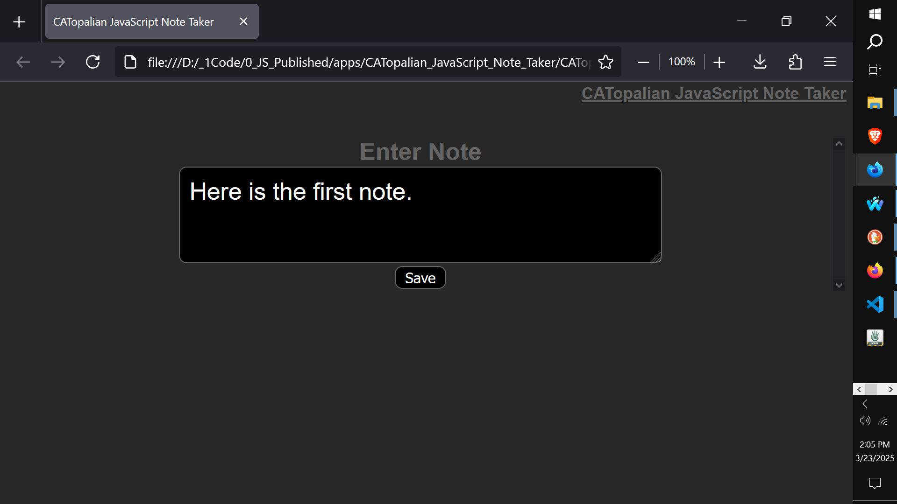

# CATopalian JavaScript Note Taker
A JavaScript application to easily take notes by typing in the textbox and then clicking the Save Button which automatically names the file by date and time for a unique name for fast note taking.  

USE APP: https://christopherandrewtopalian.github.io/CATopalian_JavaScript_Note_Taker/CATopalian_JavaScript_Note_Taker.html

If you enjoy my apps and tutorials consider buying me a coffee at [paypal.me/keystonermarch](https://www.paypal.com/paypalme/keystonermarch)  

---

### How to Download this App
1. Click the green Code Button on this github page
2. Choose Download ZIP
3. Save the Zip File
4. Extract All
5. Double click the HTML file to start the App

---

Happy Scripting :-)